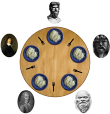

# Jantar dos Filósofos

## O Problema

- Há cinco filósofos em torno de uma mesa.
- Um garfo é colocado entre cada filósofo.
- Cada filósofo deve, alternadamente, refletir e comer.
- Para que um filósofo coma, ele deve possuir dois garfos.
    - Os dois garfos devem ser aqueles logo a sua esquerda e a sua direita.
- Para pegar um garfo
    - Somente pode ser pego por um filósofo.
    - Somente pode ser pego não estiver em uso por nenhum outro filósofo.
- Após comer, o filósofo deve liberar o garfo que utilizou.
- Um filósofo pode segurar o garfo da sua direita ou o da sua esquerda
assim que estiverem disponíveis.
    - Mas, só pode começar a comer quando ambos estiverem sob sua posse.

## Solução
Este problema é naturalmente um problema de multiprogramação, 
tendo cada filósofo como uma thread e cada garfo como um semáforo binário (ou mutex) visto que cada garfo só pode ser segurado por um único filósofo por vez

Um problema comum que ocorre nas primeiras soluções é a inanição devido o fato de ao filósofo pegar o primeiro garfo não conseguir pegar o segundo
e de forma encadeada cada filósofo pegar somente o primeiro garfo e assim gerando um _deadlock_, 
para lidar com este cenário ao tentar pegar os garfos e falhar o filósofo deve devolver a mesa e esperar um tempo aleatório para que possa tentar comer novamente.

### Solução esperada no trabalho
Os filósofos devem alternar entre os estados PENSANDO, COMENDO e TENTANDO_COMER. 
Um filósofo gasta 5 segundos pensando e 2 segundos comendo. 
Para poder comer, o filósofo deve ter sido capaz de segurar os garfos da esquerda e da direita
simultaneamente. 
Se ele não conseguir pegar os garfos ele deve entrar no estado TENTANDO_COMER e pensar durante um tempo aleatório entre 0 e 3 antes de tentar comer novamente. 

_Os três estados citados devem estar explícitos no código._

O usuário da aplicação deve ser capaz de escolher a quantidade de filósofos e o tempo de execução da aplicação. 
Ao final da execução, a aplicação deve exibir um relatório indicando os seguintes itens:
- Quantas vezes cada filósofo comeu.
- Quantas vezes cada filósofo pensou.
- Quantas vezes cada filósofo tentou comer.

### Solução aplicada em código
A solução foi aplicada utilizando três arquivos: 
- _Table.java_: Arquivo principal, responsável por criar cada filósofo gerenciando os garfos corretamente, iniciar as threads e exibir o resultado final.
- _Philosophers.java_: Implementa o comportamento do filósofo como um todo.
- _States.java_: Enumeração dos estados possíveis de um filósofo.

#### _Table_:

- Método principal: (comentado)
    ```java
    System.out.println("Digite o número de filósofos: ");
    int philosopherCount = requestPositiveNumber(); //solicitação de dado inteiro
    System.out.println("Digite o tempo de duração do programa: ");
    int runningTime = requestPositiveNumber(); //solicitação de dado inteiro
    run(philosopherCount, runningTime); //Execução do programa com os parâmetros definidos
    ```

- Execução da mesa: (comentado)
    ```java
    public static void run(int philosopherCount, int runningTime) throws InterruptedException {
        //Array de filósofos do tamanho solicitado
        Philosopher[] philosophers = new Philosopher[philosopherCount];
    
        //Criação independente do primeiro filósofo com garfos novos
        philosophers[0] = new Philosopher(0, new Semaphore(1), new Semaphore(1), runningTime);
        int index = 1;
    
        //Criação so segundo até o penultimo filósofo
        while (index < philosopherCount - 1) {
            //O garfo esquerdo de cada filósofo é o garfo direito do filósofo anterior
            Semaphore leftFork = philosophers[index - 1].rightFork;
            //O garfo direito é novo
            Semaphore rightFork = new Semaphore(1);
    
            //Adição do novo filósofo no array
            philosophers[index] = new Philosopher(index, leftFork, rightFork, runningTime);
            index++;
        }
        
        //Index agora aponta para a última posição
        //Como os anteriores, o garfo esquerdo é o garfo direito do anterior
        Semaphore leftFork = philosophers[index - 1].rightFork;
        //Garfo direito é o esquerdo do primeiro filósofo
        Semaphore rightFork = philosophers[0].leftFork;
        //Adição do último filósofo
        philosophers[index] = new Philosopher(index, leftFork, rightFork, runningTime);
    
        System.out.println("------- Iniciando filósofos -------");
        for (Philosopher philosopher : philosophers) {
            //Inicialização de todas as threads
            philosopher.start();
        }
        //Espera da thread principal pelo fim da execução de cada filósofo
        for (Philosopher philosopher : philosophers) {
            philosopher.join();
        }
    
        System.out.println("------- Relatório filósofos -------");
        for (Philosopher philosopher : philosophers) {
            //Exibição dos resultados finais de cada filósofo
            philosopher.logReport();
        }
    }
    ```

#### _Philosophers_:
- Dados armazenados num filósofo.

| Campo         | Tipo de dado | Descrição                                                          |
|---------------|--------------|--------------------------------------------------------------------|
| id            | int          | Identificador do filósofo                                          |
| runningTime   | int          | Tempo em segundos que o programa deve executar                     |
| randomizer    | Random       | Gerador de números aleatórios                                      |
| leftFork      | Semaphore    | Semáforo que simboliza o garfo a esquerda do filósofo              |
| rightFork     | Semaphore    | Semáforo que simboliza o garfo a direita do filósofo               |
| state         | States*      | Identificador do estado atual do filósofo                          |
| thinkingCount | int          | Contagem de vezes que o filósofo entrou no estado "Pensando"       |
| hungryCount   | int          | Contagem de vezes que o filósofo entrou no estado "Tentando comer" |
| eatingCount   | int          | Contagem de vezes que o filósofo entrou no estado "Comendo"        |
\* tipo enumerado é detalhado ao decorrer da explicação
- Métodos responsáveis pelas alterações de estado do filósofo: (comentados)
  
  - Estado: Pensando
  
    ```java
    private void thinking() {
        this.state = States.THINKING; //Altera o estado
        this.thinkingCount++; //Contabiliza a contagem da aplicação do estado
        this.delaySeconds(5); //Aplica a espera de 5 segundos
        this.log(); //Externaliza o novo estado a partir do console
    }
    ```  
     
  - Estado: Tentando comer
  
    ```java
    private void hungry() {
        this.state = States.HUNGRY; //Altera o estado
        this.hungryCount++; //Contabiliza a contagem da aplicação do estado
        this.delaySeconds(randomizer.nextInt(4)); //Aplica a espera aleatória entre 0 e 3 segundos (4 simboliza o limite superior exclusivo do gerador)
        this.log(); //Externaliza o novo estado a partir do console
    }
    ```    
        
  - Estado: Comendo
  
    ```java
    private void eating() {
        this.state = States.EATING; //Altera o estado
        this.eatingCount++; //Contabiliza a contagem da aplicação do estado
        this.delaySeconds(2); //Aplica a espera de 5 segundos
        this.log(); //Externaliza o novo estado a partir do console
    }
    ```
    
- Execução de um filósofo: (comentado)

    ```java
    @Override
    public void run() {
        long finalClockMillis = System.currentTimeMillis() + (runningTime * 1000); //Calcula o tempo final de execução do filósofo
        while (System.currentTimeMillis() < finalClockMillis) { //O programa executa até que tempo final deixe de ser maior que o atual
            if(!States.HUNGRY.equals(this.state)){ // se ele estiver tentando comer ele não deve parar para pensar novamente
                this.thinking(); //Começa pensando por 5 segundos
            }
            if (leftFork.tryAcquire()) { //Tenta pegar o garfo esquerdo
                if (rightFork.tryAcquire()) { //Tenta pegar o garfo direito
                    this.eating(); //Conseguiu ambos os garfos e erá comer por 2 segundos
                    rightFork.release(); //Solta o garfo esquerdo
                   leftFork.release(); //Não conseguiu o garfo direito e irá soltar o garfo esquerdo
                } else {
                    leftFork.release(); //Não conseguiu o garfo direito e irá soltar o garfo esquerdo 
                    this.hungry(); //Não conseguiu o garfo direito e irá esperar por 0 a 3 segundos para tentar novamente
                }
            } else {
                this.hungry(); //Não conseguiu o garfo esquerdo e irá esperar por 0 a 3 segundos para tentar novamente
            }
        }
    }
    ```
#### _States_:
- Estados gerenciados:

    ```java
    THINKING("Pensando"),
    HUNGRY("Tentando comer"),
    EATING("Comendo");    
    ```    
  
## Execução do código

1. Entre no diretório de fontes do projeto
    ```
    cd src/
    ```
2. Compile todos os arquivos java
    ```
    javac *.java
    ```
3. Execute o arquivo principal (Table)
   ```
   java Table
   ```
4. Insira os parâmetros de execução conforme solicitados (exemplo)
   ```
   Digite o número de filósofos: 5
   Digite o tempo de duração do programa: 30 
   ```

#### Exemplo de saída
```
Digite o número de filósofos: 5
Digite o tempo de duração do programa: 30
------- Iniciando filósofos -------
Filósofo: 1 	Status: Pensando
Filósofo: 3 	Status: Pensando
Filósofo: 5 	Status: Pensando
Filósofo: 2 	Status: Pensando
Filósofo: 4 	Status: Pensando
Filósofo: 3 	Status: Tentando comer
Filósofo: 3 	Status: Tentando comer
Filósofo: 3 	Status: Tentando comer
Filósofo: 1 	Status: Tentando comer
Filósofo: 4 	Status: Tentando comer
Filósofo: 4 	Status: Tentando comer
Filósofo: 3 	Status: Tentando comer
Filósofo: 2 	Status: Comendo
Filósofo: 5 	Status: Comendo
Filósofo: 4 	Status: Tentando comer
Filósofo: 3 	Status: Tentando comer
Filósofo: 1 	Status: Tentando comer
Filósofo: 4 	Status: Comendo
Filósofo: 3 	Status: Tentando comer
Filósofo: 1 	Status: Comendo
Filósofo: 3 	Status: Comendo
Filósofo: 2 	Status: Pensando
Filósofo: 5 	Status: Pensando
Filósofo: 5 	Status: Comendo
Filósofo: 2 	Status: Comendo
Filósofo: 4 	Status: Pensando
Filósofo: 1 	Status: Pensando
Filósofo: 4 	Status: Comendo
Filósofo: 3 	Status: Pensando
Filósofo: 1 	Status: Comendo
Filósofo: 3 	Status: Comendo
Filósofo: 2 	Status: Pensando
Filósofo: 5 	Status: Pensando
Filósofo: 2 	Status: Comendo
Filósofo: 5 	Status: Comendo
Filósofo: 4 	Status: Pensando
Filósofo: 1 	Status: Pensando
Filósofo: 4 	Status: Comendo
Filósofo: 3 	Status: Pensando
Filósofo: 1 	Status: Comendo
Filósofo: 3 	Status: Comendo
Filósofo: 2 	Status: Pensando
Filósofo: 5 	Status: Pensando
Filósofo: 2 	Status: Comendo
Filósofo: 5 	Status: Comendo
Filósofo: 4 	Status: Pensando
Filósofo: 1 	Status: Pensando
Filósofo: 4 	Status: Comendo
Filósofo: 3 	Status: Pensando
Filósofo: 1 	Status: Comendo
Filósofo: 3 	Status: Comendo
Filósofo: 2 	Status: Pensando
Filósofo: 5 	Status: Pensando
Filósofo: 2 	Status: Comendo
Filósofo: 5 	Status: Comendo
------- Relatório filósofos -------
Filósofo:1
	->Pensou: 4
	->Tentou comer: 2
	->Comeu: 4

Filósofo:2
	->Pensou: 5
	->Tentou comer: 0
	->Comeu: 5

Filósofo:3
	->Pensou: 4
	->Tentou comer: 6
	->Comeu: 4

Filósofo:4
	->Pensou: 4
	->Tentou comer: 3
	->Comeu: 4

Filósofo:5
	->Pensou: 5
	->Tentou comer: 0
	->Comeu: 5
```